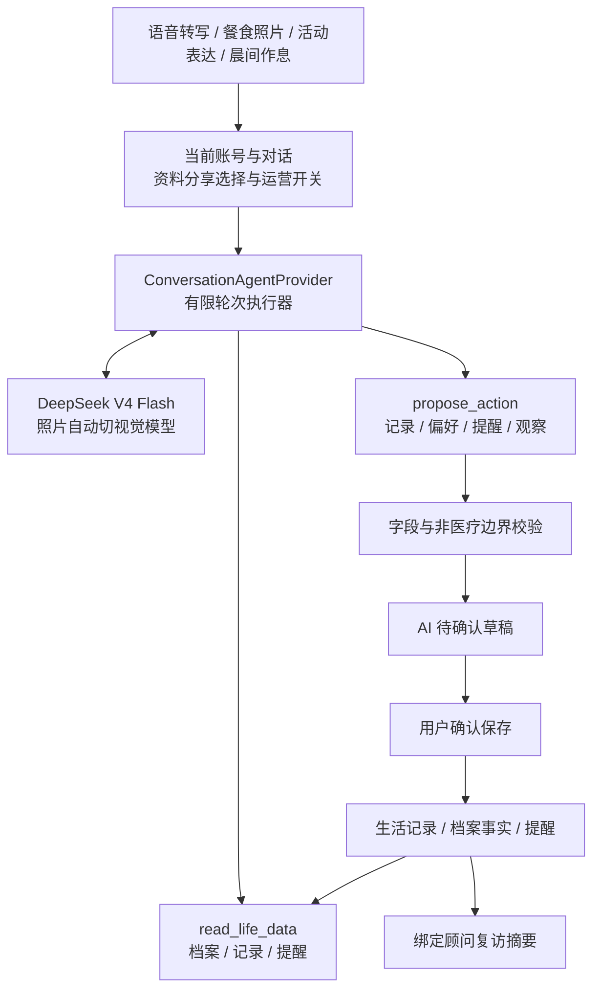

# 家庭生活智能体：架构、交互与验收

本次范围：先完成现有桌面版的智能体，预留手机与手环接口。2026-09-10 用户进一步明确：语音是主要交互，饮食尽量拍照，散步可用一句话描述，睡眠优先由用户核对入睡与起床时间。

## 原来的断点

仓库已经有 DeepSeek 文字/视觉适配器、有限生活上下文、AI 草稿校验、确认入库、会员权限与顾问摘要，并非只有 API Key。但普通 `ChatPage.send_message` 只做聊天调用；独立 `send_structured_message` 所属按钮被隐藏。已有能力没有形成正常聊天中的办事闭环，也没有受控的多轮工具执行器。

## 现在的执行链



- `services/life_agent.py`：当前对话上下文、工具调用循环、取消与执行预算。最多 4 轮模型请求、8 次工具调用。JSON 语法错误可在同一预算内纠正一次，不执行错误参数；越权、重复错误、超限或取消时不提交这一轮草稿。
- `services/agent_tools.py`：工具白名单。读取的是业务层已经授权的有限快照，工具参数没有用户 ID、SQL、任意网址或文件路径。写操作只提出建议，不直接改业务表。输入来源由程序赋值，模型不能冒充手环。
- `providers/deepseek_cloud.py`：官方 HTTPS Chat Completions 适配，非思考模式工具调用，单轮最多 4096 输出 token；模型原生 `tool_calls` 与 `tool` 结果往返。最终正常中文回复由程序装配为草稿响应，不依赖模型必须输出 JSON。保留原文字/视觉聊天能力。
- `services/ai_assistant.py`：复用已有字段白名单、时间、权限和内容校验。事实、生活记录、AI 观察分开保存；确认前只有草稿，确认后才进入生活数据。顾问摘要增加有限期内会员主动表达，明确这些表达不等于已确认事实。
- `providers/demo_life.py`：明确标注的规则演示，走同一工具循环和确认链路，不调用网络模型。只支持文档示例；不假装具备自由对话或图片理解能力。非工具型 Ollama 保留受校验的结构化单次调用兼容路径。

## 中老年人的操作方式

| 事情 | 主要入口 | 保存原则 |
|---|---|---|
| 日常交流 | 开始语音 → 结束识别 → 发送；可选择本机朗读回复 | 不要求先打字；保留核对转写的机会 |
| 这一餐 | 拍下这一餐 → 摄像头或选择手机照片 → 发送 | 识别可见食物，确认后保存；不猜重量、热量、隐含配料或是否吃完 |
| 活动 | 说“我现在出去散步了”或打同一句话 | 可以先记录发生/开始，不填没有提供的运动时长 |
| 睡眠 | 早上报睡眠，核对两个时间；也可直接说给 AI | 用户自报和设备报告分开；时间不全先问缺项 |
| 提醒 | 说出事项与时间；时间不明先追问 | 先确认，再交给已有提醒模块；不是模型后台常驻监控 |

摄像头只在点击“打开摄像头”后启动，窗口关闭即停止；无摄像头时支持选择照片。摄像头帧保存在内存，发送前仍通过原有附件检查与云端提示。原有 Vosk 离线转写保留；本机中文朗读依赖可用的系统语音组件，不可用时明确降级为文字。已用本机合成中文音频验证离线转写；本轮没有验证实际摄像头、麦克风硬件，也没有接入手机系统权限。

## 手机与手环接口

`services/device_observations.py` 提供协议版本为 1 的纯数据适配函数 `observation_to_proposal`。这是后续连接器的入口，不是假装已经接上了设备。认证后的调用方负责把结果送进现有草稿/确认服务；本轮未开放新的 HTTP 接口，也不自动导入设备记录。

```json
{
  "schema_version": 1,
  "kind": "sleep",
  "source": "wearable",
  "external_id": "vendor-record-id",
  "start_at": "2026-09-09T23:00:00+08:00",
  "end_at": "2026-09-10T07:00:00+08:00",
  "values": {}
}
```

支持 `activity`、`sleep`、`screen_inactivity`。来源可为 `self_report`、`wearable`、`screen_time`。时间必须有时区，结束晚于开始且不超过 24 小时。活动可带步数和活动类型。`screen_time` 只能产生待核对观察，不能生成睡眠时长或睡眠阶段；手机放在一边、看电视和真正睡眠不能混为一谈。未来连接器还必须处理设备授权、外部记录去重、撤销授权和时区。

Android 后续可评估 Health Connect 的运动、步数和睡眠记录接口；这依赖手机平台和设备是否写入数据，不是桌面程序能直接读取手机或任何手环。官方说明：[睡眠记录](https://developer.android.com/health-and-fitness/health-connect/features/sleep-sessions)。

## 运行与验证

从 `application/` 运行，Python 3.12 或 3.13，依赖以项目清单为准。

```bash
# 不读真实数据，不需要 Key；在临时数据库跑记录、偏好、提醒、顾问摘要闭环
PYTHONPATH=src python tools/demo_life_agent.py

# 用真实桌面组件打开同一份虚构验收数据，可继续操作
PYTHONPATH=src python tools/demo_life_agent.py --ui
```

Windows PowerShell 先设置 `$env:PYTHONPATH="src"`，再运行 `python tools/demo_life_agent.py --ui`。

正式模型：取消勾选“无 Key 演示”，在密钥弹窗配置本人 Key。默认仅本次运行内存使用；Windows 用户可主动勾选加密保存。测试使用的 Key 不进入源码、数据库、日志或报告。开启“结合我的生活资料回答”才启用读取个人资料与生成草稿的智能体链路；关闭时保留一般问答。

语音模型及 OCR 安装、Windows 打包沿用原项目。本机 Apple Silicon 验收环境使用 Vosk 0.3.44（原项目锁定的 0.3.45 没有 macOS wheel），Windows 锁定版本保持不变。当前交付是源码和可运行的桌面验收入口，不是新 Windows EXE，也没有部署线上服务或 Android APK。

官方协议依据：[DeepSeek 工具调用](https://api-docs.deepseek.com/guides/tool_calls/)、[模型与视觉能力](https://api-docs.deepseek.com/quick_start/pricing/)、[Qt 图像捕获](https://doc.qt.io/qtforpython-6/PySide6/QtMultimedia/QImageCapture.html)。

测试与真实调用结果见 `life-agent-validation.md`。
